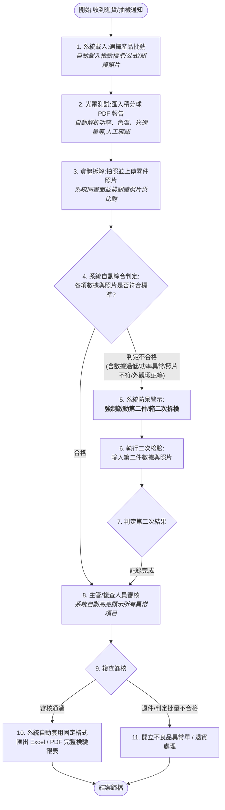

# iqc-inspect — 進貨抽檢檢驗系統 需求文件

建立日期:2026-08-03
場景:LED 燈具(吸頂燈等)進貨/出貨抽檢,數位化現行紙本「產品出/進貨抽檢記錄」表單。

## 1. 檢驗流程(使用者提供)



註:原流程第 2 步為「人工輸入積分球數據」,經確認積分球軟體(Volnic FMS-6000)可直接匯出 PDF,改為 PDF 匯入自動解析(見 §4)。

## 2. 資料層級

```
檢驗單(一張表 = 一個貨櫃)
 ├─ 櫃號、封籤號、拆櫃日期、QC 日期
 └─ 型號檢驗 × 1~3(同櫃最多三個型號並排)── 各自綁定檢驗標準版本
     ├─ 型號層級檢驗項目值(人工數值、OK/NG 勾選)
     └─ 樣品 × 1~N(第 1 件;判不合格時「強制」加第 2 件 = 二次拆檢)
         ├─ 積分球 PDF(一顆燈一份,不同樣品是不同顆燈、數據不同)
         ├─ 拆解零件照片(與認證照片並排比對)
         └─ 單項判定結果
```

## 3. 檢驗項目的五種資料來源(依實際紙本表單歸納)

| 來源類型 | 說明 | 實例(紙本表單) |
|---|---|---|
| ① 自動帶入 | 產品主檔 + 公式計算的標準值 | 標稱功率 15W、色溫 4000K±500、功率上下限 13.5~16.5(=90%~110%)、光通量 1350~1500、AQL 允收數 |
| ② PDF 匯入 | 積分球報告解析,每樣品約 6 欄 | 色溫實測、功率實測、光通量、光效、PF、CRI |
| ③ 手動數值 | 現場量測人工輸入 | 淨重實稱、外箱 kg、噪音 dB、出貨數量、缺失數 |
| ④ OK/NG 勾選 | 目視與功能測試 | 實物+首件/BOM 表、目視外觀、簽核稿件核對、QR code、開關 5 次、雙切開關、點測/老化、壁切白光 5 秒切換 |
| ⑤ 自動判定 | 實測 vs 標準範圍,超標自動高亮 | 光效實測 133.0 > 上限 100 → 高亮(取代現行人工黃螢光筆) |

每個「檢驗項目」定義:名稱、資料來源類型、標準值/公式(容差)、判定規則。不同產品類別使用不同檢驗項目模板 → **新增產品/標準不改程式**。

## 4. 積分球 PDF 匯入(三層策略)

來源:Volnic FMS-6000「电光源测试报告」PDF(軟體直接匯出,固定版面)。

1. **優先**:pdfplumber 解析文字層,自動填入欄位(100% 保真)。已知風險:中文標籤可能因字型編碼呈亂碼 → 以「版面位置 + 數字模式」定位欄位,不依賴中文關鍵字。
2. **備援(第二期,未定案)**:文字層不可用時走 OCR;候選 PaddleOCR(本地、數字不幻覺)。待取得真實 PDF 樣本檔測試後決定。
3. **保底**:永遠可人工輸入/修正。

無論哪條路,解析結果都先進「人工確認畫面」才寫入判定。

## 5. 狀態機(後端強制,防呆核心)

```
draft(草稿)
  → data_entered(數據已錄入)
  → judged(已判定)
      ├─ 合格 ────────────────→ pending_review(待審核)
      └─ 不合格 → second_inspection(二次拆檢中)
                    └─(第二件數據齊)→ pending_review
  → pending_review → approved(已簽核)→ archived(已歸檔)
                   → rejected(退件)→ defect_ticket(異常單/退貨)→ archived
```

規則(伺服器端強制,非僅 UI):
- 判定不合格的型號,**沒有第二件樣品數據不允許進入 pending_review**。
- `approved` 之後的檢驗單**不可修改**,只能作廢重開。
- 每次狀態轉移與關鍵動作寫入 append-only 稽核軌跡(誰、何時、做了什麼)。

## 6. 角色

- **檢驗員**:建單、錄入數據、上傳 PDF/照片。
- **主管/複查人員**:審核(系統高亮異常項)、簽核/退件。

## 7. 報表匯出

- **Excel**:openpyxl 套用公司現行報表模板填值,格式與紙本一致。
- **PDF**:WeasyPrint(HTML/CSS + Jinja2 模板)。

## 8. 技術棧(2026-08 查證定案)

| 層 | 選型 |
|---|---|
| 後端 | Python 3.13 + uv + FastAPI + SQLAlchemy 2.0 + SQLite |
| 前端 | Vite + Vue 3 + TypeScript + Element Plus(pnpm) |
| 型別同步 | @hey-api/openapi-ts 由後端 OpenAPI 自動產生前端 client |
| 品質 | ruff(型別檢查器後續評估 ty/Pyrefly) |
| 部署 | FastAPI 掛載前端靜態檔,單一服務,內網瀏覽器直接使用;平板/手機網頁呼叫相機拍照 |
| 環境變數 | `.env`(git 忽略)+ `.env.example` 範本 + pydantic-settings |

## 9. 分期

- **第一期(MVP)**:完整檢驗流程(建單→PDF 匯入→照片→判定→二次拆檢防呆→審核簽核→Excel/PDF 匯出)、標準版本化、稽核軌跡、角色登入。
- **第二期(預留)**:OCR 備援、AI 輔助照片比對(僅輔助不判定)、統計儀表板。

## 10. 待辦/待確認

- [ ] 取得真實 Volnic PDF 樣本檔(非螢幕照片),驗證文字層可否解析。
- [ ] 取得公司 Excel 報表模板檔。
- [ ] 確認檢驗項目完整清單與各產品類別差異(目前依吸頂燈紙本表單歸納)。
