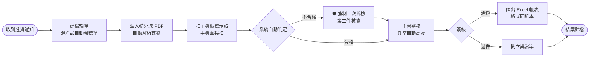

# IQC 進貨抽檢系統

## 紙本檢驗流程數位化

LED 燈具進貨/出貨抽檢 — 從手抄表單到智慧檢驗

2026-08-04

---

# 現況痛點:紙本抽檢的隱形成本

<v-clicks>

- 📝 **手抄數據** — 積分球測完報告,檢驗員逐格抄寫功率、色溫、光通量,抄錯即誤判
- 🧮 **人工算範圍** — 「標稱 15W 的 90%~110%」每個型號都要現場心算上下限
- 🖊️ **螢光筆標異常** — 超標與否靠人眼比對,漏標就流出
- 👀 **主機板比對靠肉眼** — 拆解後板上型號 vs 認證登記,一字之差(G4/B4)最容易看走眼
- 🚦 **流程靠人自覺** — 不合格該做二次拆檢、簽核前該逐項核對,漏了沒有任何機制擋住
- 📁 **追溯困難** — 客訴時翻紙本找半天,「當時為什麼判合格」說不清楚

</v-clicks>

每一步都依賴「人不出錯」— 而人一定會出錯

---

# 解決方案:一套系統管完整個檢驗流程

✅ 系統已開發完成、已上線運行 — 今天報告的是「成果」,不是「計畫」

⚡

<h3 class="mt-2">自動化</h3>

積分球 PDF 一鍵匯入、合格範圍自動計算、異常自動高亮 — 取代手抄、心算、螢光筆

🛡️

<h3 class="mt-2">防呆</h3>

不合格強制二次拆檢、標示未確認不能簽核 — 規則由系統強制,不靠自覺

🔍

<h3 class="mt-2">可追溯</h3>

誰、何時、做了什麼全程留痕;簽核後永久鎖定 — 稽核、客訴隨時拿得出證據

---

# 檢驗流程:數位化後的完整動線

與現行紙本流程一一對應 — 檢驗員不用改變工作習慣,只是把紙換成畫面

---
layout: image-right
image: /images/list.png
backgroundSize: contain
---

# 系統實際畫面

**檢驗單列表**

- 一張單 = 一個貨櫃
- 狀態一目了然:草稿 → 待審核 → 已簽核 → 已歸檔
- QC 日期自動帶入當天
- 手機、平板、電腦都能用 (檢驗員現場拿手機操作)

---

# 積分球數據:從手抄到一鍵匯入

### 以前
1. 積分球軟體印出報告
2. 檢驗員逐格手抄 6 個數字
3. 抄錯、看錯行、單位搞混…

### 現在
1. 報告 PDF 拖進系統
2. **自動解析**光通量、色溫、功率、光效、PF、CRI
3. 人工核對一眼 → 按「確認數據」

💡 三層保險:PDF 文字層解析(100% 保真)→ 辨識不到退人工輸入 → 確認畫面把關 
數據永遠經過人眼確認才進判定,系統不會「自作主張」

---
layout: image-right
image: /images/detail.png
backgroundSize: contain
---

# 自動判定與異常高亮

**取代人工計算和螢光筆**

- 合格範圍由**公式自動算** (標稱 15W → 13.5~16.5W)
- 超標欄位**自動紅框**+說明 「133.0 高於上限 100」
- 一路帶到審核畫面和 Excel (黃底紅字,同螢光筆習慣)
- 判定是**規則引擎**,不是 AI — 同樣數據永遠同樣結果,可稽核

---

# 三道防呆關卡:系統強制,不靠自覺

| 關卡 | 規則 | 沒過會怎樣 |
|------|------|-----------|
| **二次拆檢** | 判不合格 → 必須完成第二件檢驗 | 系統拒絕送審 |
| **標示照片** | 每型號必須有主機板標示特寫照 | 系統拒絕送審 |
| **主管確認** | 主管逐型號勾「標示與認證一致」 | 系統拒絕簽核 |

這些規則做在**伺服器端** — 不是畫面上的提示,是繞不過去的閘門。 
對應痛點「流程靠人自覺」:該做的步驟,系統替主管把關,漏不掉。

---
layout: image-right
image: /images/products.png
backgroundSize: contain
---

# 產品主檔:新型號一分鐘上線

**每個型號的「標準答案」建檔一次**

- 標稱參數(瓦數、光通量範圍…)
- 預期主機板標示字串
- 認證照片(選填)

**兩層設計的威力**

- 檢驗標準只定義「公式」
- 新型號**不用建新標準**, 填參數就自動算出合格範圍
- 現有 30 份標準 Excel 遷移入庫, 檢法相同者可望共用(以實際盤點為準)

---

# AI 亮點 ①:主機板標示比對

### 怎麼運作

1. 檢驗員手機拍主機板標示特寫
2. **本機 AI 模型**讀出板上字串
3. 程式與認證登記**精確比對**
4. 🟢 一致 / 🟡 不一致提醒主管細看

### 實測成果

- 特寫照 **1.5 秒**讀出完整型號
- `G4` vs `B4` **一字之差正確抓出** (人眼最容易漏的就是這種)

### 設計底線

**AI 只提示,不判定。**

模型負責「讀」,比對是程式的精確邏輯,最終勾選確認永遠是主管 — AI 讀錯最多是提示沒幫上忙,不會造成誤放行。

模型在公司電腦本機運行(Ollama) 照片與數據不出內網、零 API 費用

---

# AI 亮點 ②:AI 助手

### 能做什麼

- 讀懂**當前檢驗單的完整數據**
- 「這張單有哪些異常?」 「為什麼判不合格?」— 直接回答並引用數據
- 新人詢問流程,不用翻 SOP

### 一樣有底線

- 只**解讀說明**,不參與判定
- 畫面明示:「判定以系統規則為準」
- 同樣跑在本機,資料不外流

💬 實測:問「這張檢驗單有異常嗎?」→ 正確回答狀態與判定,並引用實際量測值佐證

---

# 稽核與追溯:每一步都有據可查

<v-clicks>

- 📜 **稽核軌跡** — 建單、錄入、判定、確認、簽核…誰在何時做了什麼,只增不改
- 🔒 **簽核即鎖定** — 已簽核的單永久唯讀,杜絕事後竄改
- 📌 **標準版本化** — 檢驗單綁定當時的標準版本,半年後回看判定依據分毫不差
- 📷 **照片政策** — 上傳自動壓縮(5MB→0.3MB);保存期限可設定,未歸檔前絕不清除
- 📊 **Excel 報表** — 格式對齊現行紙本,主管、客戶不用適應新格式

</v-clicks>

---

# 技術架構:精簡、可靠、好維護

| 層 | 選型 |
|----|------|
| 後端 | Python + FastAPI |
| 前端 | Vue 3 + Tailwind |
| 資料庫 | SQLite(單檔好備份) |
| AI | Ollama 本機模型 |
| 部署 | 單一服務,一台主機全包 |

### 品質保證

- **27 個自動化測試**全數通過
- 防呆關卡逐一端對端驗證
- 前後端型別自動同步 (後端改欄位,前端編譯即報錯)

### 已可展示

- 已部署上線(HTTPS)
- 手機/平板/電腦全支援

---

# 下一步

| 順序 | 項目 | 說明 |
|------|------|------|
| 短期 | **30 份檢驗標準入庫** | 現有 Excel 一次性遷移,逐份人工核對 |
| 短期 | **Excel 報表模板套版** | 拿到公司原版模板後,輸出 100% 一致 |
| 接著 | **正式部署** | 搬進正式主機,含帳號密碼強化 |
| 第二期 | 標準管理後台、統計儀表板 | 主管自行維護標準;月報數據一鍵出 |

系統本體已完成並上線 — 剩下的是資料遷移與交付,不是開發風險

<b>需要的支援</b>:公司報表 Excel 模板、30 份檢驗標準檔案、正式部署主機

---
layout: center
class: text-center
---

# 總結

紙本抽檢的**手抄、心算、肉眼比對** → 系統的**自動解析、自動判定、AI 輔助比對**

3 道

伺服器端強制防呆關卡

1 分鐘

新型號上線(免改程式)

100%

檢驗軌跡可追溯

Q & A

